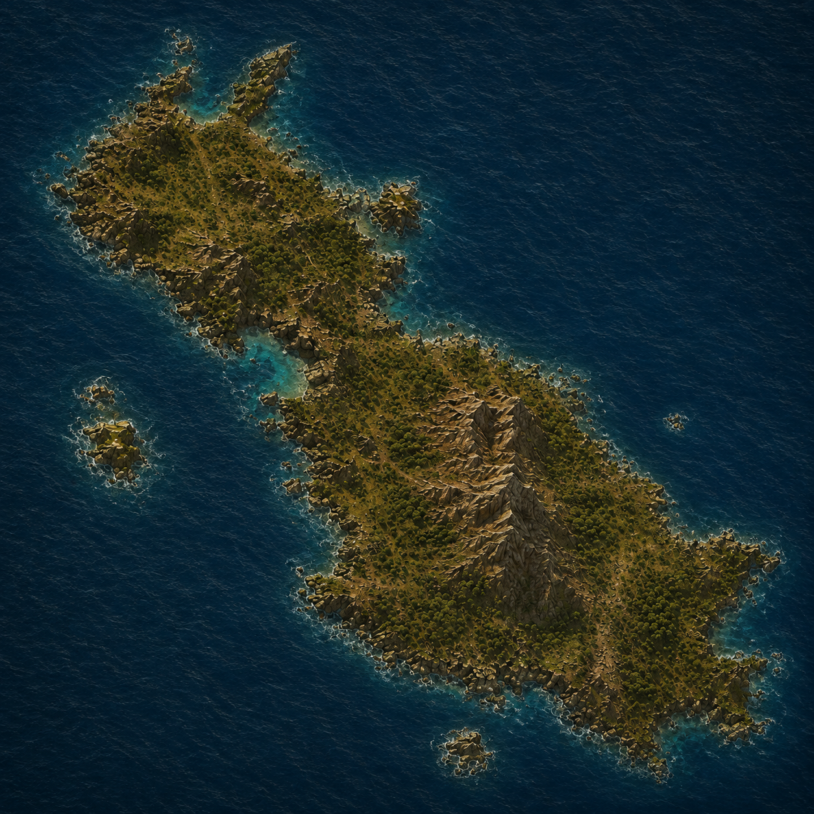

    
<a href="../Oikumena/">&larr; Карта Ойкумены</a>

    <h1>Мани</h1>
    
Суровый остров посреди беспокойных морей, считающийся колыбелью древней Империи. Именно отсюда когда-то распространились её язык, вера и законы, и даже после падения державы Мани остаётся символическим центром — местом, где всё ещё правит Императорский род, пусть и лишь номинально.

    

        <map-canvas>
            
        </map-canvas>
            <a href="#Miterion" class="map-label" style="bottom: 42%; right: 36%;">Митерион</a>
            <a href="#Blackforest" class="map-label" style="bottom: 23%; right: 17%;">Чёрный лес</a>
            <a href="#Kadaranbay" class="map-label" style="top: 15%; left: 20%;">Бухта Кадаран</a>
            <a href="#Dendra-Hilja" class="map-label" style="top: 33%; left: 33%;">Дендра-Хилья</a>
            <a href="#Western-Valleys" class="map-label" style="bottom: 40%; right: 45%;">Западные долины</a>
            <a href="#Gurdianbay" class="map-label" style="bottom: 37%; right: 19%;">Гурдийская бухта</a>
    

    

        

            <h2>Митерион</h2>
            
Город-храм в сердце центральных гор. Последнее крупное поселение Мани, где в значительном количестве сохранились каменные здания времён Империи. Город окружает последнее святилище Жёлтого Солнца и служит домом для ордена Митер и Митриари. Добраться сюда можно лишь через несколько горных дорог и перевалов, поэтому Митерион веками оставался относительно защищённым от войн и разграбления.

        

        

            <h2>Чёрный лес</h2>
            
Юго-восточный сосновый лес на высоком скалистом побережье. Земли клана Маврокардиа. Тёмные сосны растут почти до самых обрывов, между которыми скрываются узкие каменистые бухты. Внутри леса мало дорог — преимущественно старые тропы охотников, лесорубов и контрабандистов. С моря побережье выглядит почти неприступным.

        

        

            <h2>Бухта Кадаран</h2>
            
Крайний север Мани. Земли клана де Кадаран. Холодная открытая бухта, окружённая каменистыми холмами и скалами. От побережья вверх уходят длинные долины и древние тропы, связывающие небольшие поселения и укреплённые усадьбы. Земля здесь беднее южной, а жизнь сильнее зависит от моря, выпаса скота и контроля проходов через северные холмы.

        

        

            <h2>Дендра-Хилья</h2>
            
Древняя имперская кедровая роща, ныне огромный одичавший хвойный лес. Земли клана Макариос. Когда-то кедры здесь высаживали и охраняли для нужд имперского флота и храмов. После падения Империи рощи поглотил обычный лес, однако среди сосен всё ещё встречаются исполинские тысячелетние кедры. Некоторые старые дороги, каменные межевые знаки и заброшенные сторожки ещё можно найти под корнями и мхом.

        

        

            <h2>Западные долины</h2>
            
Плодородные западные земли клана Сазмакис. Широкие травянистые долины, разделённые невысокими холмами и зарослями кустарника. Лучшие пастбища Мани: здесь разводят коз, овец, лошадей и часть крупного скота острова. В отличие от лесистого востока, местность открытая и хорошо просматривается на многие мили.

        

        

            <h2>Гурдийская бухта</h2>
            
Юго-западные ворота Мани. Защищённая от большей части морских ветров гавань, куда традиционно заходят корабли из Гурдии, а также альфаранские контрабандисты. На берегу выросло отдельное поселение гурдийских беженцев — более пёстрое и чужеземное, чем остальные поселения острова. Через бухту на Мани попадают товары, оружие, слухи и люди.

        

