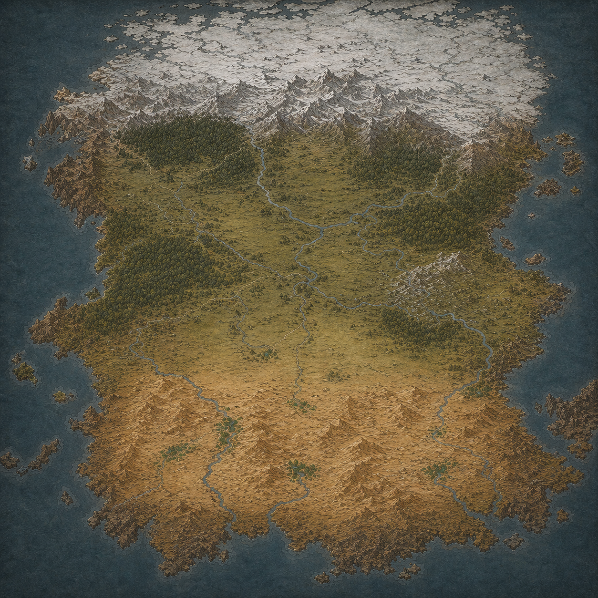

            

                
                    <a href="../Waldmark/" class="map-label" style="top: 32%; left: 25%;">Вальдмарк</a>
                    <a href="../Lirenia/" class="map-label" style="top: 29%; right: 43%;">Лирения</a>
                    <a href="../Silvirhelt/" class="map-label" style="top: 44%; left: 17%;">Сильвирхельт</a>
                    <a href="../Vikkirland/" class="map-label" style="top: 19%; left: 7%;">Виккирланд</a>
                    <a href="../Rum/" class="map-label" style="bottom: 26%; left: 31%;">Рум</a>
                    <a href="../Mani/" class="map-label" style="bottom: 35%; left: 4%;">Мани</a>
            

            

                

                    <h2>Вальдмарк</h2>
                    
Королевство на севере бывшей великой империи, выросшее из пограничных марок, созданных для защиты от северных племён. Земли плодородны, но постоянно под давлением извне. Теперь им управляет наследный Король и аристократы из древних влиятельных семей.

                

                

                    <h2>Виккирланд</h2>
                    
Суровый союз островных кланов, раскинувшихся среди холодных морей и скалистых берегов. Здесь земля бедна, ветер жесток, а море кормит и убивает с одинаковой щедростью. Долгие века острова были раздроблены — каждый фьорд, каждая долина принадлежали своему клану. Но внешние угрозы и вечные междоусобицы привели к созданию унии, во главе которой стоит избираемый правитель — Хайкарл, верховный предводитель и первый среди равных.

                

                

                    <h2>Лирения</h2>
                    
Богатое и уравновешенное королевство широких равнин и речных долин, где земля ценится выше меча. Здесь меньше диких лесов и суровых гор — вместо них простираются зелёные пастбища, обработанные поля и плавные холмы, удобные для жизни и хозяйства. Климат мягкий, реки полноводны, а почвы щедры — всё это делает Лирению одной из самых обеспеченных стран региона.

                

                

                    <h2>Сильвирхельт</h2>
                    
Это не страна и не королевство. Это бескрайний массив древних лесов, где нет единой власти, дорог и законов, кроме тех, что диктует сама чаща. Когда-то Империя проложила здесь тракты, возвела заставы и заставила племена склониться. Но после её падения лес закрылся вновь — дороги заросли, крепости опустели, а люди Сильвирхельта вернулись к старому укладу.
                

                

                    <h2>Мани</h2>
                    
Cуровый остров посреди беспокойных морей, считающийся колыбелью древней Империи. Именно отсюда когда-то распространились её язык, вера и законы, и даже после падения державы Мани остаётся символическим центром — местом, где всё ещё правит Императорский род, пусть и лишь номинально.

                

                

                    <h2>Рум</h2>
                    
Древнее шахство, выросшее из города-государства и пережившее империи, королевства и кочевые союзы. Его столица — старейший из живущих городов мира, где улицы помнят эпохи, о которых другие народы знают лишь по легендам. Власть здесь принадлежит Великому Шаху и его династии — не просто правителям, но хранителям порядка, установленного ещё в древности.

                

            

        

