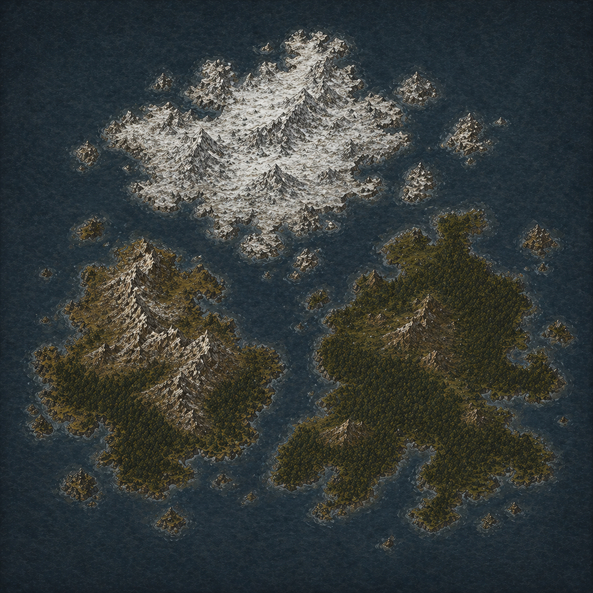

    

        <map-canvas>
            
        </map-canvas>
            <a href="#Skogholm" class="map-label" style="bottom: 40%; right: 22%;">Скогхольм</a>
            <a href="#Draugholm" class="map-label" style="bottom: 35%; left: 22%;">Драугхольм</a>
            <a href="#Bjornfjall" class="map-label" style="top: 20%; left: 40%;">Бьёрнфьелль</a>
    

    
    

        

            <h2>Скогхольм</h2>
            
Самый тёплый и пригодный для жизни остров Утхольма. 
                Его холмы и долины покрыты густыми хвойными лесами, зарослями кустарника и вересковыми пустошами. Среди деревьев скрываются руины старых виккирских поселений, покинутых много поколений назад. 
                Скогхольм богат древесиной, дичью и пресной водой, поэтому именно здесь новые переселенцы чаще всего закладывают свои хутора и длинные дома.

        

        

            <h2>Драугхольм</h2>
            
Мрачный и суровый остров, известный своими скалистыми берегами и горными кряжами. 
                Леса здесь редки и цепляются лишь за защищённые от ветра долины, а большую часть острова занимают каменистые пустоши и отвесные утёсы.
                Старые саги рассказывают, что когда-то здесь бесследно исчезла целая колония мореходов, из-за чего остров получил своё зловещее название.
                Среди виккиров до сих пор ходят истории о призрачных огнях на склонах гор и голосах, слышимых во время зимних бурь.

        

        

            <h2>Бьёрнфьелль</h2>
            
Самый северный остров архипелага и самое суровое место Утхольма.
                Его земли большую часть года покрыты снегом и льдом, а над побережьем возвышаются заснеженные вершины и ледниковые долины. 
                Лишь узкая полоса тундры вдоль южных берегов пригодна для жизни. Здесь водятся моржи, зуброяки и огромные белые медведи, от которых остров и получил своё название.
                Немногие решаются поселиться на Бьёрнфьелле, но его горы богаты железной рудой и камнем, что привлекает самых отчаянных колонистов.

        

    

