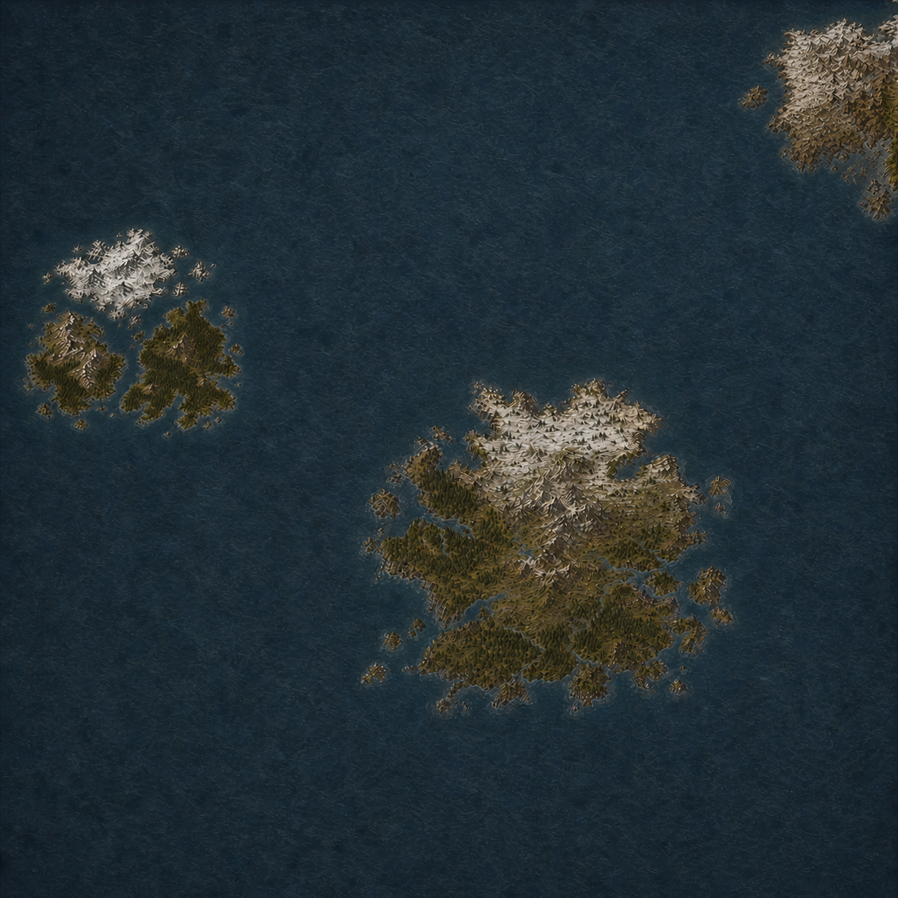

    

        
            <a href="../Eirskell/" class="map-label" style="bottom: 38%; right: 33%;">Эйрскелл</a>
            <a href="#Utholm" class="map-label" style="top: 36%; left: 5%;">Архипелаг Утхольм</a>
            <a href="#Vorngar" class="map-label" style="top: 12%; right: 3%;">Земли Ворнгар</a>
    

    
    

        

            <h2>Эйрскелл</h2>
            
Удаленный остров, стоящий на пути штормов. Его бухты — единственное безопасное место на многие мили вокруг. Сильные ветра, узкие фьорды - земля скальдов, мореходов и искателей приключений.
        

    

        <h2>Земли Ворнгар</h2>
        
Для виккирских кланов это не просто территория — это новый материк, холодный, опасный и чуждый..

    

    

        <h2>Архипелаг Утхольм</h2>
        
Плохо изученные небольшие острова, слишком далекие для постоянного снабжения и частых экспедиций.

    

