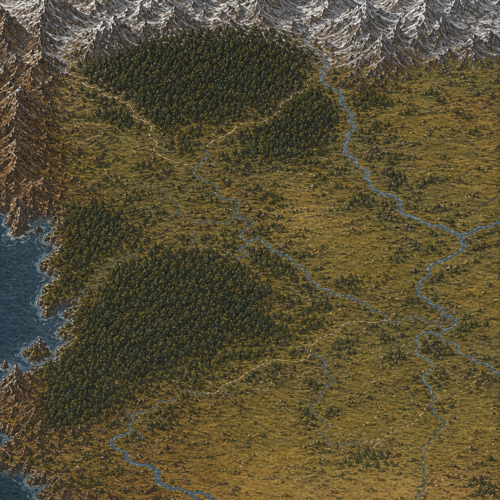

            

                
                    <a href="../Ostroga/" class="map-label" style="top: 15%; left: 10%;">Крепость Острога</a>
                    <a href="../Falcen/" class="map-label" style="top: 16%; right: 40%;">Крепость Фалькен</a>
                    <a href="../Holmgard/" class="map-label" style="top: 35%; left: 30%;">Хольмгард</a>
                    <a href="../Brokengard/" class="map-label" style="top: 59%; left: 5%;">Брокенгард</a>
                    <a href="../Windhaim/" class="map-label" style="top: 54%; left: 54%;">Виндхейм</a>
                    <a href="../grasshaim/" class="map-label" style="bottom: 30%; right: 35%;">Грассхейм</a>
            

            

                

                    <h2>Крепость Острога</h2>
                    
Каменная крепость, где правит местный лорд. Крепость возвышается над окрестностями и защищает жителей. Она стала пристанищем для многих беженцев из пострадавших от набегов деревень.

                

                

                    <h2>Монастырский двор (разграблен дикарями)</h2>
                    
Некогда процветающая деревня сейчас покинута и разграблена. Возможно, ее все еще можно будет восстановить.

                

                

                    <h2>Гнилая лужа</h2>
                    
Маленькая деревня в болотистой местности, местные занимаются сбором болотных трав, грибов и выпасом немногочисленного скота.

                

                

                    <h2>Грюнфельд</h2>
                    
Городок на юге, купающаяся в солнечном свете. Здесь живут богатые семьи, торгующие зерном и мёдом. Местные жители гордятся своей пивоварней, и даже в крепости ценят их напитки.

                

                

                    <h2>Медвежий двор</h2>
                    
Небольшое поселение у опушки леса. Жители — дровосеки, охотники и углежоги. Здесь ценят силу и молчаливый труд. Ночами над деревней тянется дым костров и смоляных печей.

                

            

        

