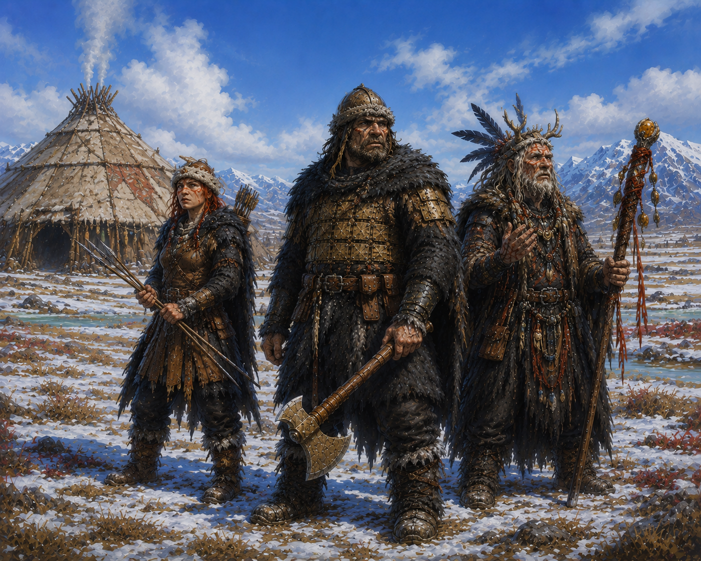

## Описание

Кел'друм — древний народ тундр и холодных лесов, кочевники и охотники, живущие на границе мира живых и мира духов. Они выше и массивнее людей юга: широкие грудные клетки, тяжёлые кости, грубые черты лица. Их движения неторопливы, но выносливы и точны. Они не спешат — потому что холод учит терпению.

Их жизнь строится вокруг разведения зуброяков, охоты и сезонных переходов. Они не строят городов, только временные стоянки, следуя за зверем, ветром и знаками духов.

## Характеристики

| Параметр | Значение |
| --- | --- |
| Скорость | 30 фт |

## Расовые черты

### Морозостойкость

Их тела удерживают тепло, а разум не боится стужи.  
Имеют сопротивление урону холодом и игнорируют штрафы сложной местности снега и льда.

### Адаптация

Получают бонусы к навыкам:

- Выживание +2
- Уход за животными +2
- Мистика +2

### Дар Старых Богов

Каждый кел'друм с рождения несёт в себе связь с духами, которые помогают видеть скрытое от глаз обычных людей.

### Чужаки

–2 к проверкам Харизмы против представителей других рас.

### Уязвимость к ядам

Получают помеху на первый спасбросок против яда, а эффекты отравления длятся на один ход дольше.

### Тяжёлое телосложение

–1 к проверкам Скрытности.
